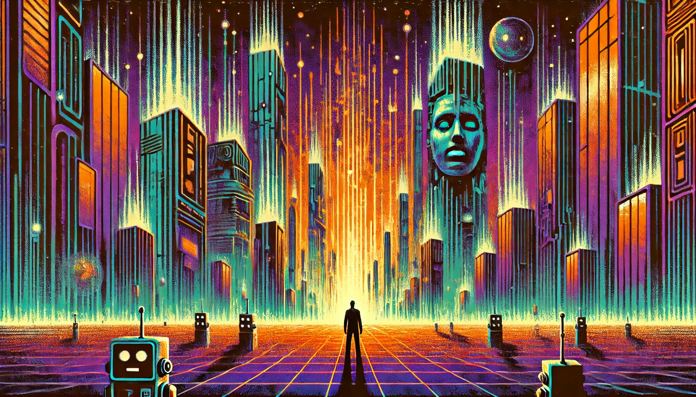

> "Apathy's a tragedy/
And boredom is a crime/
Anything and everything/
All of the time
" - Bo Burnham

Recently, I rewatched Bo Burnham's journey to his insanity in his special Inside. The first time I watched it was in 2021, during the heights of Covid. As a fan of his absurd musical humor, I came in expecting a similar vibe. However, I was left stunned. The special planted this indescribable seed of existential dread. Sure, I laughed; but I also noticed a void opening up, and I was staring straight into the abyss. If you're asking whether I'd enjoyed the show, then I'll say this only: It's the best comedy that you should never watch. Nonetheless, the pandemic ended; life was normal again. And schools opened up again. And we got meet each other in person again. And I never had to look at void again... And then the AI boom happened.

During this past summer, I was scrolling through Youtube, mindlessly, when I stumbled upon what's known "The Dead Internet Theory". It is this emerging theory that most -- if not all -- online interactions nowadays are bots talking to one another in this endless feedback loop, while we struggle to discern who's human and who isn't. Slowly, we would grow further apart from each other in a social platform that was design to connect us. It was then the void screamed for me again; this exact feeling came crawling back. That's when I decided to find to that Bo Burnham, then to further research: about online interactions, and AI user recommendation, or just generally what got us here in the first place! 

### Authenticity is Automated
In less than a decade, generative AI has fundamentally reshaped the internet. Platforms like X (formerly Twitter) and Instagram are awash with AI-generated content, from oddly perfect memes to surreal images of AI-crafted humans. These creations often toe the line between amusing and uncanny, leaving users questioning the authenticity of their online interactions. Are we engaging with humans or just machines mimicking humanity?

This ambiguity takes a psychological toll. Every like, comment, or share feels like a small, unwitting participation in a Turing Test. Worse yet, the prevalence of AI-generated content has displaced genuine human creativity, transforming what was once a vibrant, messy digital landscape into something cold and impersonal. The result? A crisis of authenticity. Can we trust what we consume online anymore? And what does this mean for our relationships with one another?

### Online Cultures, Homogenized
Modern recommender systems, designed to maximize user engagement, are another culprit in the erosion of online authenticity. These algorithms prioritize content similar to what we've already interacted with, creating a self-reinforcing loop of predictability. While this might keep us scrolling, it limits our horizons, boxing us into ever-narrower echo chambers.

This phenomenon extends beyond social media. Streaming platforms like Netflix often push content that mirrors our past preferences rather than encouraging exploration. Over time, this "safety-first" approach homogenizes online culture, stripping away the serendipity that once defined the internet. The vibrant patchwork of human creativity is replaced by a bland, algorithm-driven monoculture. The result? A digital world that feels smaller, duller, and less capable of fostering meaningful connections.

### The Imperfect Human Curations
Yet, amidst this algorithmic dominance, a quiet resistance is emerging. Platforms like "Perfectly Imperfect" are reclaiming the art of human curation. By prioritizing personal recommendations and community-driven content, these spaces celebrate the messiness and subjectivity of human taste. Here, recommendations come not from faceless algorithms but from real people sharing their unique perspectives.

This shift highlights the power of human agency in digital discovery. Unlike algorithms, which strive for efficiency and predictability, human curators embrace imperfection and surprise. They remind us that the internet can still be a space for genuine connection—a place where the act of sharing a song, book, or movie becomes an invitation to understand someone else’s world.

### Taking Our Space Back!
The rise of "anti-algorithm" communities is a testament to our collective yearning for authenticity. From DIY curation collectives to platforms that prioritize transparency and trust, these initiatives are carving out spaces where human creativity can thrive. But resistance alone isn’t enough. We need proactive solutions: policies that promote transparency, AI designs that prioritize diversity, and digital literacy programs that empower users to navigate the online world thoughtfully.

The internet should be more than just a tool for consumption. It should be a reflection of our humanity—messy, diverse, and endlessly surprising. By embracing this vision, we can build a digital world that celebrates our differences, fosters genuine connections, and guides us toward unexpected discoveries.

## Conclusion
As we navigate the ever-evolving landscape of the internet, we face a critical choice. Will we allow AI to erode the authenticity and warmth that once defined our online spaces? Or will we reclaim these spaces, using technology to amplify human connection rather than replace it?

The answer lies in striking a balance between machine efficiency and human creativity. By fostering platforms that prioritize serendipity and diversity, we can ensure that the internet remains a space for genuine expression and connection. It’s time to take back our digital world and make it a place where authenticity can flourish once again.

## References
1. Walter, Y. (2024). *Artificial Influencers and the Dead Internet Theory*. AI & Society. [https://doi.org/10.1007/s00146-023-01857-0](https://doi.org/10.1007/s00146-023-01857-0)
2. Mariani, R. (2023). *The Dead Internet to Come*. The New Atlantis, 73, 34–42. [https://www.jstor.org/stable/27244117](https://www.jstor.org/stable/27244117)
3. Chayka, K. (2024a). *The Banality of Online Recommendation Culture*. The New Yorker. [http://www.newyorker.com/culture/infinite-scroll/the-banality-of-online-recommendation-culture](http://www.newyorker.com/culture/infinite-scroll/the-banality-of-online-recommendation-culture)
4. Chayka, K. (2024b). *The New Generation of Online Culture Curators*. The New Yorker. [http://www.newyorker.com/culture/infinite-scroll/the-new-generation-of-online-culture-curators](http://www.newyorker.com/culture/infinite-scroll/the-new-generation-of-online-culture-curators)
5. Nguyen, K. (2024, January 29). *Perfectly Imperfect Launches an Earnest, Anti-algorithm Social Network*. The Verge. [http://www.theverge.com/creators/24054294/perfectly-imperfect-pi-fyi-app-tyler-bainbridge](http://www.theverge.com/creators/24054294/perfectly-imperfect-pi-fyi-app-tyler-bainbridge)
6. Lacker, B., & Way, S. (2024). *Socially-Motivated Music Recommendation*. Proceedings of the International AAAI Conference on Web and Social Media, 18, 879–90. [https://doi.org/10.1609/icwsm.v18i1.31359](https://doi.org/10.1609/icwsm.v18i1.31359)
